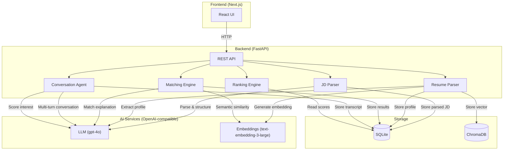

# Architecture — TalentScout AI

## System Diagram



## Data Flow

```
JD Text ─► AI Parse ─► Structured JD (title, skills, experience, education)
                                │
Resume PDFs ─► AI Extract ─► Candidate Profiles + Embeddings
                                │
                    ┌───────────┴───────────┐
                    ▼                       ▼
             Match Engine              Conversation Agent
          (4-signal scoring)          (4-turn simulation)
                    │                       │
                    ▼                       ▼
              Match Score              Interest Score
                    │                       │
                    └───────────┬───────────┘
                                ▼
                         Ranking Engine
                    Final Score → Shortlist
```

## Tech Stack

| Layer | Technology |
|-------|-----------|
| Frontend | Next.js 16, React 19, TypeScript, Tailwind CSS |
| Backend | FastAPI, Python 3.12, uvicorn |
| AI | OpenAI SDK (gpt-4o + text-embedding-3-large) |
| Database | SQLite (async via SQLModel + aiosqlite) |
| Vector Store | ChromaDB (persistent) |
| Containerization | Docker, Docker Compose |

## Component Details

### Frontend (Next.js)

Single-page app with 6 workflow screens:

| Page | Purpose |
|------|---------|
| `/` | Dashboard — entry point with workflow cards |
| `/jd` | Paste & parse job descriptions |
| `/candidates` | Upload resumes, view parsed profiles |
| `/matching` | Run matching, view score breakdowns |
| `/conversations` | Trigger AI conversations, view transcripts |
| `/shortlist` | Final ranked shortlist with all scores |

### Backend Services

| Service | File | Responsibility |
|---------|------|---------------|
| **JD Parser** | `app/services/jd_parser.py` | LLM-powered extraction of title, skills (must-have/nice-to-have), experience range, education from raw JD text |
| **Resume Parser** | `app/services/resume_parser.py` | PDF text extraction → LLM-powered profile structuring → embedding generation via ChromaDB |
| **Matching Engine** | `app/services/matching_engine.py` | 4-signal scoring: semantic similarity, skill match, experience fit, education match |
| **Conversation Agent** | `app/services/conversation_agent.py` | Simulates 4-turn recruiter-candidate conversations using dual-persona LLM prompting |
| **Ranking Engine** | `app/services/ranking_engine.py` | Combines Match Score + Interest Score into Final Score for shortlist ranking |

### Storage

- **SQLite** (via SQLModel + aiosqlite): Stores JDs, candidates, match results, conversation transcripts
- **ChromaDB** (persistent): Stores resume text embeddings for semantic similarity search

### API Endpoints

| Method | Endpoint | Description |
|--------|----------|-------------|
| POST | `/api/jd/parse` | Parse a raw JD into structured format |
| GET | `/api/jd/` | List all parsed JDs |
| POST | `/api/candidates/upload` | Upload resume PDF(s) |
| GET | `/api/candidates/` | List all candidates |
| DELETE | `/api/candidates/{id}` | Delete candidate + cascade |
| POST | `/api/matching/run` | Run matching for a JD |
| GET | `/api/matching/results/{jd_id}` | Get match results |
| POST | `/api/conversations/start` | Start AI conversations |
| GET | `/api/conversations/{id}` | Get conversation transcript |
| GET | `/api/shortlist/{jd_id}` | Get final ranked shortlist |
| DELETE | `/api/reset` | Clear all data |
