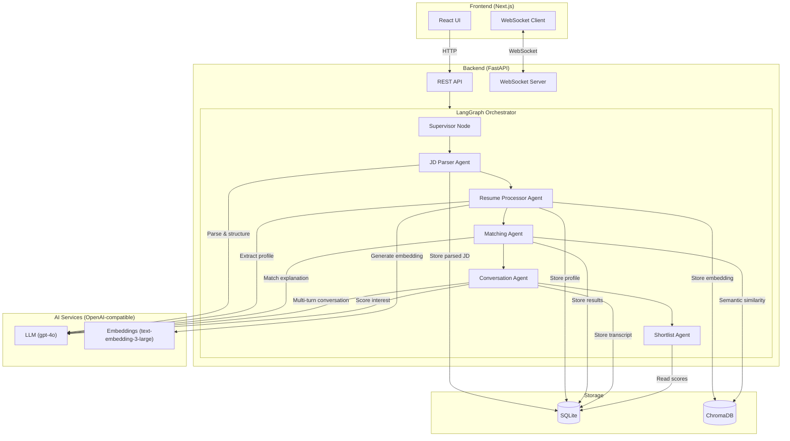
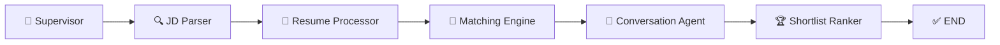

# TalentScout AI — AI-Powered Talent Scouting & Engagement Agent

> Built by [Vikash Kumar](https://www.linkedin.com/in/vikash-kumar-835b31ba) with ❤️

An **Agentic AI system** that takes a Job Description as input, discovers matching candidates from uploaded resumes, engages them conversationally to assess interest, and outputs a ranked shortlist scored on **Match Score** and **Interest Score**.

Powered by a **LangGraph multi-agent orchestrator** with real-time **WebSocket progress streaming**, dark/light theme toggle, and a premium modern UI.

---

## 📑 Table of Contents

- [Docker Quick Start](#-docker-quick-start-recommended)
- [Local Development Setup](#-local-development-setup)
- [Features](#-features)
- [Architecture](#-architecture)
- [Scoring System](#-scoring-system)
- [Sample Data & Outputs](#-sample-data--outputs)
- [Multi-Agent Pipeline (LangGraph)](#-multi-agent-pipeline-langgraph)
- [Tech Stack](#-tech-stack)
- [Project Structure](#-project-structure)
- [Backend Services](#-backend-services)
- [API Reference](#-api-reference)
- [Frontend Pages](#-frontend-pages)
- [Data Models](#-data-models)
- [Environment Variables](#-environment-variables)
- [Troubleshooting](#-troubleshooting)

---

## 🐳 Docker Quick Start (Recommended)

### Prerequisites
- [Docker](https://docs.docker.com/get-docker/) and [Docker Compose](https://docs.docker.com/compose/install/) installed
- OpenAI-compatible API key

### Setup & Run

1. **Clone the repository**
   ```bash
   git clone https://github.com/vikartp/TalentScout-AI.git
   cd TalentScout-AI
   ```

2. **Configure backend environment**
   ```bash
   cp backend/.env.example backend/.env
   ```
   
   Edit `backend/.env` and add your API credentials:
   ```bash
   OPENAI_API_KEY=your-api-key-here
   OPENAI_API_BASE=https://api.openai.com/v1
   ```

3. **Start all services**
   ```bash
   docker compose up --build
   ```
   
   First run will take a few minutes to build images. You'll see containers:
   - `vikash-talentscout-backend` — FastAPI on port 8000
   - `vikash-talentscout-frontend` — Next.js on port 3000

4. **Access the application**
   - Frontend: [http://localhost:3000](http://localhost:3000)
   - Backend API: [http://localhost:8000](http://localhost:8000)
   - API Docs (Swagger): [http://localhost:8000/docs](http://localhost:8000/docs)

5. **Stop services**
   ```bash
   docker compose down
   ```
   
   To also remove data volumes:
   ```bash
   docker compose down -v
   ```

### Notes
- All data (SQLite DB + ChromaDB embeddings) persists in the `backend-data` Docker volume
- Changes to code require rebuilding: `docker compose up --build`
- Logs: `docker compose logs -f vikash-talentscout-backend` or `docker compose logs -f vikash-talentscout-frontend`

---

## 💻 Local Development Setup

### Prerequisites
- Python 3.12+, [uv](https://docs.astral.sh/uv/)
- Node.js 20+
- OpenAI-compatible API key

### 1. Clone & Configure

```bash
git clone https://github.com/vikartp/TalentScout-AI.git
cd TalentScout-AI
```

Copy environment files and set your API keys:
```bash
cp backend/.env.example backend/.env
cp frontend/.env.example frontend/.env.local
```

### 2. Run Backend
```bash
cd backend
uv sync
uv run python -m uvicorn app.main:app --reload --port 8000
```

API docs: [http://localhost:8000/docs](http://localhost:8000/docs)

### 3. Run Frontend
```bash
cd frontend
npm install
npm run dev
```

Open [http://localhost:3000](http://localhost:3000).

---

## ✨ Features

- **Autopilot Mode** — One-click: upload a JD + resume ZIP → 5 AI agents handle everything automatically
- **Real-Time WebSocket Streaming** — Live agent progress streamed via WebSocket to the browser as LangGraph nodes execute
- **Multi-Agent Orchestration** — LangGraph-powered sequential pipeline with typed shared state and error-aware short-circuiting
- **4-Signal Match Scoring** — Semantic similarity (40%), skill match (30%), experience fit (15%), education match (15%)
- **AI Conversation Simulation** — Dual-persona LLM prompting simulates realistic recruiter-candidate outreach
- **Interest Scoring** — Enthusiasm, availability, salary alignment, cultural fit — scored from conversation transcripts
- **Session Persistence** — Autopilot state cached in `sessionStorage` so users don't lose progress when navigating
- **Dark/Light Theme** — Toggle between dark and light mode (dark by default) via `next-themes`
- **Sample Data Pack** — One-click button loads a pre-packaged JD + 12 sample resumes for instant testing
- **Manual Workflow** — Every pipeline stage (JD parse, resume upload, matching, conversations, shortlist) is also available as individual pages
- **Docker Ready** — Full `docker compose` setup for instant deployment

---

## 🏗 Architecture



### Data Flow

```
JD Text ─► AI Parse ─► Structured JD (title, skills, experience, education)
                                │
Resume PDFs ─► AI Extract ─► Candidate Profiles + Embeddings
                                │
                    ┌───────────┴───────────┐
                    ▼                       ▼
             Match Engine              Conversation Agent
          (4-signal scoring)          (4-turn simulation)
                    │                       │
                    ▼                       ▼
              Match Score              Interest Score
                    │                       │
                    └───────────┬───────────┘
                                ▼
                         Ranking Engine
                    Final Score → Shortlist
```

---

## 📈 Scoring System

TalentScout uses a **two-stage scoring pipeline**: a deterministic **Match Score** and an AI-generated **Interest Score**.

### Match Score (0–100) — 4 Weighted Signals

| Signal | Weight | Method |
|--------|--------|--------|
| **Semantic Similarity** | 40% | Cosine similarity of JD & resume embeddings (`text-embedding-3-large`) |
| **Skill Match** | 30% | Fuzzy matching; must-have skills weighted 2× vs nice-to-have |
| **Experience Fit** | 15% | Gaussian penalty around JD's ideal range (σ=3 years) |
| **Education Match** | 15% | Ordinal degree comparison (5-level scale) |

**Formula:**
```
Match Score = (0.40 × Semantic + 0.30 × Skill + 0.15 × Experience + 0.15 × Education) × 100
```

#### Signal Details

- **Semantic Similarity (40%)** — Both JD and resume text are embedded via `text-embedding-3-large`. Cosine similarity captures domain/role alignment beyond keyword matching.
- **Skill Match (30%)** — Fuzzy substring matching with delimiter splitting (`/`, `,`, `&`). Must-have weighted **2×**: `Score = (matched_must × 2 + matched_nice) / (total_must × 2 + total_nice)`
- **Experience Fit (15%)** — Gaussian decay: `Score = exp(-0.5 × (distance / 3)²)`. Within range → 1.0, unknown → 0.5.
- **Education Match (15%)** — Ordinal scale (HS=1, Associate=2, Bachelor=3, Master=4, PhD=5). Meets/exceeds → 1.0, one below → 0.7, two+ → 0.4.

### Interest Score (0–100) — From AI Conversations

Generated from **4-turn simulated recruiter-candidate conversations** using dual-persona LLM prompting, then evaluated by a separate LLM scorer.

| Dimension | Weight | What it Measures |
|-----------|--------|-----------------|
| **Enthusiasm** | 30% | How excited/interested is the candidate? |
| **Availability** | 25% | How soon can they start/interview? |
| **Salary Alignment** | 25% | How aligned are compensation expectations? |
| **Cultural Fit** | 20% | Values and motivation alignment with role |

**Formula:**
```
Interest Score = (0.30 × Enthusiasm + 0.25 × Availability + 0.25 × Salary + 0.20 × Cultural) × 10
```

### Final Ranking

```
Final Score = 0.6 × Match Score + 0.4 × Interest Score
```

> **Rationale:** Match Score is weighted higher because technical fit is a prerequisite. The 60/40 split still gives meaningful weight to interest, reflecting that engaged candidates are more likely to accept and succeed. The weight is configurable via the UI slider.

---

## 🧪 Sample Data & Outputs

### Included Sample Data

The [`sample-data/`](sample-data/) directory contains ready-to-use test data:

| File | Description |
|------|-------------|
| `jds/jd-senior-fullstack.txt` | Senior Full-Stack Developer JD |
| `jds/jd-data-scientist.txt` | Data Scientist — Machine Learning JD |
| `jds/jd-devops-engineer.txt` | DevOps Engineer JD |
| `resumes/` | 12 sample resume PDFs with diverse profiles |
| `resume_data.py` | Raw resume data used to generate PDFs |
| `generate_resumes.py` | Script to regenerate resume PDFs |

### Example Shortlist Output

| Rank | Candidate | Match Score | Interest Score | Final Score |
|------|-----------|-------------|----------------|-------------|
| 1 | Priya Sharma | 82.4 | 85.0 | 83.4 |
| 2 | Rahul Mehta | 78.1 | 72.0 | 75.7 |
| 3 | Ananya Iyer | 71.5 | 68.0 | 70.1 |

### Detailed Score Breakdown (Top Candidate)

```json
{
  "candidate": "Priya Sharma",
  "semantic_score": 87.2,
  "skill_score": 85.0,
  "experience_score": 100.0,
  "education_score": 100.0,
  "match_score": 82.4,
  "matched_skills": ["react.js", "node.js", "typescript", "postgresql", "rest apis", "docker"],
  "missing_skills": [],
  "interest_scores": {
    "enthusiasm": 9,
    "availability": 8,
    "salary_alignment": 8,
    "cultural_fit": 9,
    "interest_score": 85.0
  },
  "final_score": 83.4
}
```

---

## 🤖 Multi-Agent Pipeline (LangGraph)

The Autopilot mode uses a **LangGraph StateGraph** with 6 sequential nodes sharing a typed `PipelineState`:



| Node | Agent | Responsibility |
|------|-------|---------------|
| 1 | **Supervisor** | Initializes pipeline, dispatches to specialists |
| 2 | **JD Parser** | LLM-powered extraction of structured requirements from raw JD text |
| 3 | **Resume Processor** | Extracts text from ZIP → LLM parsing → ChromaDB embedding per candidate |
| 4 | **Matching Engine** | 4-signal scoring per candidate against the JD |
| 5 | **Conversation Agent** | Simulates 4-turn recruiter-candidate conversations, scores interest |
| 6 | **Shortlist Ranker** | Combines Match + Interest scores → ranked output |

**Real-Time Streaming:** The orchestrator uses `pipeline.astream(stream_mode="values")` to push state updates via WebSocket after each node completes. The frontend receives live logs and progress updates without polling.

---

## 🛠 Tech Stack

| Layer | Technology |
|-------|-----------|
| Frontend | Next.js 16, React 19, TypeScript, Tailwind CSS v4 |
| Backend | FastAPI, Python 3.12, uvicorn |
| AI / LLM | OpenAI SDK (gpt-4o + text-embedding-3-large) |
| Orchestration | LangGraph (StateGraph, sequential multi-agent pipeline) |
| Real-Time | WebSocket (FastAPI native + JS native WebSocket) |
| Database | SQLite (async via SQLModel + aiosqlite) |
| Vector Store | ChromaDB (persistent) |
| Theme | next-themes (dark/light toggle) |
| Icons | Lucide React |
| Containerization | Docker, Docker Compose |

---

## 📁 Project Structure

```
TalentScout-AI/
├── backend/
│   ├── app/
│   │   ├── api/
│   │   │   ├── autopilot.py          # Autopilot endpoints + WebSocket
│   │   │   ├── candidates.py         # Resume upload & management
│   │   │   ├── conversations.py      # AI conversation endpoints
│   │   │   ├── jd.py                 # Job Description parsing
│   │   │   ├── matching.py           # Match scoring endpoints
│   │   │   └── shortlist.py          # Ranked shortlist endpoint
│   │   ├── db/
│   │   │   ├── database.py           # SQLite async setup
│   │   │   └── vector_store.py       # ChromaDB setup
│   │   ├── models/                   # SQLModel data models
│   │   ├── services/
│   │   │   ├── orchestrator.py       # LangGraph multi-agent pipeline
│   │   │   ├── ws_manager.py         # WebSocket connection manager
│   │   │   ├── jd_parser.py          # LLM JD parsing
│   │   │   ├── resume_parser.py      # PDF/DOCX extraction + LLM parsing
│   │   │   ├── matching_engine.py    # 4-signal match scorer
│   │   │   ├── conversation_agent.py # Dual-persona conversation simulator
│   │   │   └── ranking_engine.py     # Final score calculator
│   │   ├── config.py                 # Environment config
│   │   └── main.py                   # FastAPI app entry point
│   ├── Dockerfile
│   ├── pyproject.toml
│   └── .env.example
├── frontend/
│   ├── src/
│   │   ├── app/
│   │   │   ├── autopilot/page.tsx    # Autopilot Mode (one-click pipeline)
│   │   │   ├── jd/page.tsx           # JD parsing page
│   │   │   ├── candidates/page.tsx   # Resume management page
│   │   │   ├── matching/page.tsx     # Match scoring page
│   │   │   ├── conversations/page.tsx# Conversation management
│   │   │   ├── shortlist/page.tsx    # Ranked shortlist page
│   │   │   ├── page.tsx              # Dashboard
│   │   │   ├── layout.tsx            # Root layout + ThemeProvider
│   │   │   └── globals.css           # Tailwind v4 config
│   │   ├── components/
│   │   │   ├── Sidebar.tsx           # Navigation + theme toggle + credits
│   │   │   └── ThemeProvider.tsx     # next-themes wrapper
│   │   └── lib/
│   │       └── api.ts                # Backend API client
│   ├── Dockerfile
│   ├── package.json
│   └── .env.example
├── sample-data/
│   ├── jds/                          # 3 sample job descriptions
│   ├── resumes/                      # 12 sample resume PDFs
│   ├── resume_data.py                # Raw data for resume generation
│   └── generate_resumes.py           # Script to regenerate PDFs
├── docker-compose.yml
└── README.md                         # ← You are here
```

---

## ⚙ Backend Services

| Service | File | Responsibility |
|---------|------|---------------|
| **JD Parser** | `services/jd_parser.py` | LLM-powered extraction of title, skills (must-have/nice-to-have), experience range, education from raw JD text |
| **Resume Parser** | `services/resume_parser.py` | PDF/DOCX text extraction → LLM-powered profile structuring → embedding generation via ChromaDB |
| **Matching Engine** | `services/matching_engine.py` | 4-signal scoring: semantic similarity (40%), skill match (30%), experience fit (15%), education match (15%) |
| **Conversation Agent** | `services/conversation_agent.py` | Simulates 4-turn recruiter-candidate conversations using dual-persona LLM prompting |
| **Ranking Engine** | `services/ranking_engine.py` | Combines Match Score + Interest Score into Final Score for shortlist ranking |
| **Orchestrator** | `services/orchestrator.py` | LangGraph-powered sequential multi-agent pipeline with WebSocket streaming |
| **WS Manager** | `services/ws_manager.py` | WebSocket connection manager for real-time progress updates |

---

## 📡 API Reference

### Health & Admin

| Method | Path | Description |
|--------|------|-------------|
| `GET` | `/` | Health check |
| `DELETE` | `/api/reset` | Drop and recreate all database tables + clear ChromaDB |

### Job Descriptions — `/api/jd`

| Method | Path | Description |
|--------|------|-------------|
| `POST` | `/api/jd/parse` | Parse a JD text via LLM and store it |
| `GET` | `/api/jd/` | List all JDs (id, title, seniority, location) |
| `GET` | `/api/jd/{jd_id}` | Get full JD detail |
| `DELETE` | `/api/jd/clear` | Clear all JD records |

### Candidates — `/api/candidates`

| Method | Path | Description |
|--------|------|-------------|
| `POST` | `/api/candidates/upload` | Upload resumes (PDF/DOCX), parse via LLM, store embeddings |
| `GET` | `/api/candidates/` | List all candidates |
| `GET` | `/api/candidates/{id}` | Get full candidate detail |
| `DELETE` | `/api/candidates/{id}` | Delete candidate + cascade (matches, conversations, embeddings) |
| `DELETE` | `/api/candidates/clear` | Clear all candidates + cascade all related data |

### Matching — `/api/matching`

| Method | Path | Description |
|--------|------|-------------|
| `POST` | `/api/matching/run` | Run matching for a JD against all candidates |
| `GET` | `/api/matching/results/{jd_id}` | Get stored match results with score breakdown |
| `DELETE` | `/api/matching/clear` | Clear all match results |

### Conversations — `/api/conversations`

| Method | Path | Description |
|--------|------|-------------|
| `POST` | `/api/conversations/start` | Simulate recruiter-candidate conversation and score interest |
| `GET` | `/api/conversations/{id}` | Get conversation transcript and scores |
| `GET` | `/api/conversations/by-jd/{jd_id}` | List all conversations for a JD |
| `DELETE` | `/api/conversations/clear` | Clear all conversations |

### Shortlist — `/api/shortlist`

| Method | Path | Description |
|--------|------|-------------|
| `GET` | `/api/shortlist/{jd_id}` | Ranked shortlist combining match and interest scores |

> Query param: `match_weight` (0–1, default 0.6) controls the match vs interest balance.

### Autopilot — `/api/autopilot`

| Method | Path | Description |
|--------|------|-------------|
| `POST` | `/api/autopilot/run` | Run full multi-agent pipeline (JD text + resume ZIP → shortlist) |
| `GET` | `/api/autopilot/sample-zip` | Download pre-packaged sample resumes ZIP for testing |
| `WS` | `/api/autopilot/ws/{run_id}` | WebSocket for real-time pipeline progress streaming |

---

## 🖥 Frontend Pages

| Page | Route | Purpose |
|------|-------|---------|
| **Dashboard** | `/` | Entry point with workflow cards + autopilot banner |
| **Autopilot** | `/autopilot` | One-click pipeline: JD + resume ZIP → fully automated with live WebSocket progress |
| **Job Descriptions** | `/jd` | Paste & parse job descriptions manually |
| **Candidates** | `/candidates` | Upload resumes, view parsed profiles, delete with cascade |
| **Matching** | `/matching` | Run matching, view detailed score breakdowns |
| **Conversations** | `/conversations` | Trigger AI conversations, view transcripts & interest scores |
| **Shortlist** | `/shortlist` | Final ranked shortlist with all scores; auto-loads on page visit |

### UI Features
- **Dark/Light Theme Toggle** — Sidebar footer with smooth toggle (dark mode default)
- **Glassmorphism Sidebar** — Premium footer design with ambient glows
- **Pipeline Progress Tracker** — Visual step-by-step progress bar synced to WebSocket events
- **Live Agent Log** — Terminal-style real-time log viewer with color-coded entries
- **Session Persistence** — Autopilot state cached in `sessionStorage` for tab navigation resilience
- **"Load Sample Data" Button** — Pre-loads JD + 12 resumes for quick testing
- **Auto-Expand Top Candidate** — Shortlist page auto-opens the #1 ranked candidate on load

---

## 📊 Data Models

### JobDescription
`id`, `raw_text`, `title`, `department`, `seniority`, `skills_must_have`, `skills_nice_to_have`, `experience_min/max`, `education`, `location`, `responsibilities`, `salary_min/max`, `parsed_json`, `created_at`

### Candidate
`id`, `name`, `email`, `phone`, `current_role`, `current_company`, `skills`, `total_experience_years`, `education`, `work_history`, `achievements`, `resume_text`, `parsed_json`, `filename`, `created_at`

### MatchResult
`id`, `jd_id`, `candidate_id`, `semantic_score`, `skill_score`, `experience_score`, `education_score`, `match_score`, `explanation`, `matched_skills`, `missing_skills`, `created_at`

### Conversation
`id`, `jd_id`, `candidate_id`, `transcript`, `interest_score`, `enthusiasm`, `availability`, `salary_alignment`, `cultural_fit`, `score_explanation`, `status`, `created_at`

---

## 🔧 Environment Variables

### Backend (`backend/.env`)

| Variable | Default | Description |
|----------|---------|-------------|
| `OPENAI_API_KEY` | *(required)* | OpenAI-compatible API key |
| `OPENAI_API_BASE` | `https://api.openai.com/v1` | API base URL |
| `DATABASE_URL` | `sqlite+aiosqlite:///./talentscout.db` | SQLite connection string |
| `CHROMA_PERSIST_DIR` | `./chroma_db` | ChromaDB storage path |
| `EMBEDDING_MODEL` | `text-embedding-3-large` | Embedding model name |
| `CHAT_MODEL` | `gpt-4o` | Chat model name |

### Frontend (`frontend/.env.local`)

| Variable | Default | Description |
|----------|---------|-------------|
| `NEXT_PUBLIC_API_URL` | `http://localhost:8000` | Backend API URL |

---

## 🔥 Troubleshooting

| Issue | Solution |
|-------|---------|
| AI gets stuck at any pipeline step | Use the **"Clear Database"** button on the Dashboard page and retry |
| WebSocket not connecting | Ensure backend is running. The WS URL is derived from `NEXT_PUBLIC_API_URL` (http → ws) |
| Resume ZIP not processing | Ensure ZIP contains `.pdf` or `.docx` files (not nested in subfolders) |
| Docker build fails | Run `docker compose down -v` to clean up, then `docker compose up --build` |
| Theme toggle not working | Ensure `next-themes` is installed and `ThemeProvider` wraps the layout |
| Autopilot state lost on page navigation | State is cached in `sessionStorage`. It persists across tab switches but resets on browser close |
| `uv` trampoline / canonicalization error | Run using `uv run python -m uvicorn app.main:app --reload --port 8000` instead |
