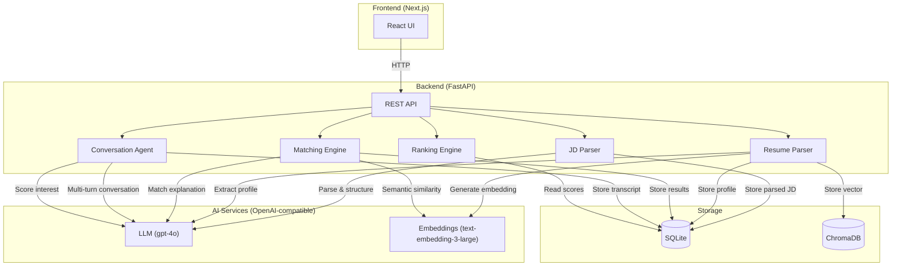

# TalentScout AI — AI-Powered Talent Scouting & Engagement Agent

An AI agent that takes a Job Description as input, discovers matching candidates from uploaded resumes, engages them conversationally to assess interest, and outputs a ranked shortlist scored on **Match Score** and **Interest Score**.

## Docker Quick Start (Recommended)

### Prerequisites
- [Docker](https://docs.docker.com/get-docker/) and [Docker Compose](https://docs.docker.com/compose/install/) installed
- OpenAI-compatible API key

### Setup & Run

1. **Clone the repository**
   ```bash
   git clone https://github.com/vikartp/TalentScout-AI.git
   cd TalentScout-AI
   ```

2. **Configure backend environment**
   ```bash
   cp backend/.env.example backend/.env
   ```
   
   Edit `backend/.env` and add your API credentials:
   ```bash
   OPENAI_API_KEY=your-api-key-here
   OPENAI_API_BASE=https://api.openai.com/v1  # or your custom endpoint
   ```

3. **Start all services**
   ```bash
   docker compose up --build
   ```
   
   First run will take a few minutes to build images.

4. **Access the application**
   - Frontend: [http://localhost:3000](http://localhost:3000)
   - Backend API: [http://localhost:8000](http://localhost:8000)
   - API Docs: [http://localhost:8000/docs](http://localhost:8000/docs)

5. **Stop services**
   ```bash
   docker compose down
   ```
   
   To also remove data volumes:
   ```bash
   docker compose down -v
   ```

### Notes
- All data (SQLite DB + ChromaDB embeddings) persists in the `backend-data` Docker volume
- Changes to code require rebuilding: `docker compose up --build`
- Logs: `docker compose logs -f backend` or `docker compose logs -f frontend`

## Local Development Setup

### Prerequisites
- Python 3.12+, [uv](https://docs.astral.sh/uv/)
- Node.js 20+
- OpenAI-compatible API key

### 1. Clone & Configure

```bash
git clone https://github.com/vikartp/TalentScout-AI.git
cd TalentScout-AI
```

Copy environment files and set your API keys:
```bash
cp backend/.env.example backend/.env
cp frontend/.env.example frontend/.env.local
```

### 2. Run Backend
```bash
cd backend
uv sync
uv run uvicorn app.main:app --reload --port 8000
```

### 3. Run Frontend
```bash
cd frontend
npm install
npm run dev
```

Open [http://localhost:3000](http://localhost:3000).

## Project Structure

```
├── backend/           # FastAPI + OpenAI + ChromaDB
├── frontend/          # Next.js + TypeScript + Tailwind
├── sample-data/       # Example JDs and resumes
├── ARCHITECTURE.md    # System diagram, data flow, tech stack, API endpoints
├── SCORING.md         # Scoring formulas, weights, and detailed methodology
├── SAMPLES.md         # Sample inputs & outputs at every pipeline stage
└── docker-compose.yml
```

See [backend/README.md](backend/README.md) and [frontend/README.md](frontend/README.md) for details.

## Architecture

> Full details: [ARCHITECTURE.md](ARCHITECTURE.md)



## How It Works

1. **Paste a Job Description** → AI parses it into structured requirements (title, must-have/nice-to-have skills, experience range, education)
2. **Upload Resumes** → AI extracts candidate profiles & generates vector embeddings stored in ChromaDB
3. **Match** → Multi-signal scoring ranks candidates against the JD
4. **Engage** → AI simulates recruiter-candidate conversations to gauge interest
5. **Shortlist** → Combined Match Score + Interest Score → ranked output

## Scoring System

> Full details: [SCORING.md](SCORING.md)

**Match Score** (0–100) — 4 weighted signals:

| Signal | Weight | Method |
|--------|--------|--------|
| Semantic Similarity | 40% | Cosine similarity of embeddings |
| Skill Match | 30% | Fuzzy matching; must-have weighted 2× |
| Experience Fit | 15% | Gaussian penalty (σ=3 years) |
| Education Match | 15% | Ordinal degree comparison |

**Interest Score** (0–100) — from AI-simulated conversations:

| Dimension | Weight |
|-----------|--------|
| Enthusiasm | 30% |
| Availability | 25% |
| Salary Alignment | 25% |
| Cultural Fit | 20% |

**Final Score** = `0.6 × Match Score + 0.4 × Interest Score`

## Sample Inputs & Outputs

> Full details: [SAMPLES.md](SAMPLES.md)

| Rank | Candidate | Match Score | Interest Score | Final Score |
|------|-----------|-------------|----------------|-------------|
| 1 | Priya Sharma | 82.4 | 85.0 | 83.4 |
| 2 | Rahul Mehta | 78.1 | 72.0 | 75.7 |
| 3 | Ananya Iyer | 71.5 | 68.0 | 70.1 |

## Tech Stack

| Layer | Technology |
|-------|-----------|
| Frontend | Next.js 16, React 19, TypeScript, Tailwind CSS |
| Backend | FastAPI, Python 3.12, uvicorn |
| AI | OpenAI SDK (gpt-4o + text-embedding-3-large) |
| Database | SQLite (async via SQLModel + aiosqlite) |
| Vector Store | ChromaDB (persistent) |
| Containerization | Docker, Docker Compose |
