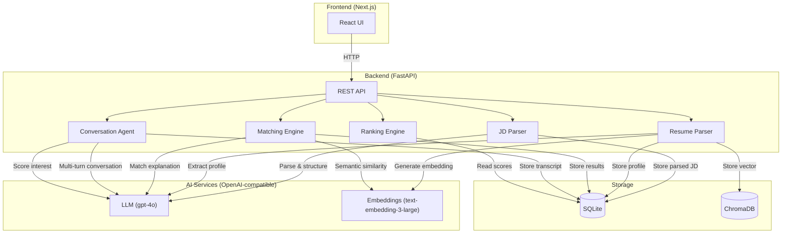

# TalentScout AI — AI-Powered Talent Scouting & Engagement Agent

An AI agent that takes a Job Description as input, discovers matching candidates from uploaded resumes, engages them conversationally to assess interest, and outputs a ranked shortlist scored on **Match Score** and **Interest Score**.

## Docker Quick Start (Recommended)

### Prerequisites
- [Docker](https://docs.docker.com/get-docker/) and [Docker Compose](https://docs.docker.com/compose/install/) installed
- OpenAI-compatible API key

### Setup & Run

1. **Clone the repository**
   ```bash
   git clone https://github.com/vikartp/TalentScout-AI.git
   cd TalentScout-AI
   ```

2. **Configure backend environment**
   ```bash
   cp backend/.env.example backend/.env
   ```
   
   Edit `backend/.env` and add your API credentials:
   ```bash
   OPENAI_API_KEY=your-api-key-here
   OPENAI_API_BASE=https://api.openai.com/v1  # or your custom endpoint
   ```

3. **Start all services**
   ```bash
   docker compose up --build
   ```
   
   First run will take a few minutes to build images.

4. **Access the application**
   - Frontend: [http://localhost:3000](http://localhost:3000)
   - Backend API: [http://localhost:8000](http://localhost:8000)
   - API Docs: [http://localhost:8000/docs](http://localhost:8000/docs)

5. **Stop services**
   ```bash
   docker compose down
   ```
   
   To also remove data volumes:
   ```bash
   docker compose down -v
   ```

### Notes
- All data (SQLite DB + ChromaDB embeddings) persists in the `backend-data` Docker volume
- Changes to code require rebuilding: `docker compose up --build`
- Logs: `docker compose logs -f backend` or `docker compose logs -f frontend`

## Local Development Setup

### Prerequisites
- Python 3.12+, [uv](https://docs.astral.sh/uv/)
- Node.js 20+
- OpenAI-compatible API key

### 1. Clone & Configure

```bash
git clone https://github.com/vikartp/TalentScout-AI.git
cd TalentScout-AI
```

Copy environment files and set your API keys:
```bash
cp backend/.env.example backend/.env
cp frontend/.env.example frontend/.env.local
```

### 2. Run Backend
```bash
cd backend
uv sync
uv run uvicorn app.main:app --reload --port 8000
```

### 3. Run Frontend
```bash
cd frontend
npm install
npm run dev
```

Open [http://localhost:3000](http://localhost:3000).

## Project Structure

```
├── backend/          # FastAPI + OpenAI + ChromaDB
├── frontend/         # Next.js + TypeScript + Tailwind
├── sample-data/      # Example JDs and resumes
└── docker-compose.yml
```

See [backend/README.md](backend/README.md) and [frontend/README.md](frontend/README.md) for details.

## Architecture



### Data Flow

```
JD Text ─► AI Parse ─► Structured JD (title, skills, experience, education)
                                │
Resume PDFs ─► AI Extract ─► Candidate Profiles + Embeddings
                                │
                    ┌───────────┴───────────┐
                    ▼                       ▼
             Match Engine              Conversation Agent
          (4-signal scoring)          (4-turn simulation)
                    │                       │
                    ▼                       ▼
              Match Score              Interest Score
                    │                       │
                    └───────────┬───────────┘
                                ▼
                         Ranking Engine
                    Final Score → Shortlist
```

## How It Works

1. **Paste a Job Description** → AI parses it into structured requirements (title, must-have/nice-to-have skills, experience range, education)
2. **Upload Resumes** → AI extracts candidate profiles & generates vector embeddings stored in ChromaDB
3. **Match** → Multi-signal scoring ranks candidates against the JD (see Scoring below)
4. **Engage** → AI simulates recruiter-candidate conversations to gauge interest
5. **Shortlist** → Combined Match Score + Interest Score → ranked output

## Scoring System

### Match Score (0–100)

Computed from four weighted signals:

| Signal | Weight | Method |
|--------|--------|--------|
| **Semantic Similarity** | 40% | Cosine similarity between JD and resume embeddings (`text-embedding-3-large`) |
| **Skill Match** | 30% | Fuzzy substring matching; must-have skills weighted 2× vs nice-to-have |
| **Experience Fit** | 15% | Gaussian penalty around the JD's ideal experience range (σ=3 years) |
| **Education Match** | 15% | Ordinal comparison of candidate's highest degree vs JD requirement |

```
Match Score = (0.40 × Semantic + 0.30 × Skill + 0.15 × Experience + 0.15 × Education) × 100
```

### Interest Score (0–100)

Generated from AI-simulated 4-turn recruiter-candidate conversations, then scored by an LLM evaluator:

| Dimension | Weight | Scale |
|-----------|--------|-------|
| **Enthusiasm** | 30% | 1–10: How excited is the candidate? |
| **Availability** | 25% | 1–10: How soon can they start? |
| **Salary Alignment** | 25% | 1–10: How aligned are compensation expectations? |
| **Cultural Fit** | 20% | 1–10: Values and motivation alignment |

```
Interest Score = (0.30 × Enthusiasm + 0.25 × Availability + 0.25 × Salary + 0.20 × Cultural) × 10
```

### Final Ranking

```
Final Score = 0.6 × Match Score + 0.4 × Interest Score
```

Candidates are sorted by Final Score descending to produce the shortlist.

## Sample Inputs & Outputs

### Sample JD Input

```
Senior Full-Stack Developer — React + Node.js

Company: TechCorp Solutions
Location: Bangalore, India (Hybrid)
Must-Have: React.js, Node.js, TypeScript, PostgreSQL, REST APIs
Nice-to-Have: GraphQL, AWS/GCP, Docker, CI/CD
Experience: 4-8 years
Education: Bachelor's in CS or equivalent
```

### Sample Matching Output

| Rank | Candidate | Match Score | Interest Score | Final Score |
|------|-----------|-------------|----------------|-------------|
| 1 | Priya Sharma | 82.4 | 85.0 | 83.4 |
| 2 | Rahul Mehta | 78.1 | 72.0 | 75.7 |
| 3 | Ananya Iyer | 71.5 | 68.0 | 70.1 |

### Sample Score Breakdown

```json
{
  "candidate": "Priya Sharma",
  "semantic_score": 87.2,
  "skill_score": 85.0,
  "experience_score": 100.0,
  "education_score": 100.0,
  "match_score": 82.4,
  "matched_skills": ["react.js", "node.js", "typescript", "postgresql", "rest apis", "docker"],
  "missing_skills": [],
  "interest_scores": {
    "enthusiasm": 9,
    "availability": 8,
    "salary_alignment": 8,
    "cultural_fit": 9,
    "interest_score": 85.0
  },
  "final_score": 83.4
}
```

### Sample Conversation Excerpt

```
[RECRUITER]: Hi Priya! I came across your profile and was really impressed by your
full-stack experience. We have a Senior Full-Stack Developer role at TechCorp that
I think could be a great fit. Would you be open to hearing more?

[CANDIDATE]: Hi! Thanks for reaching out. I'm always open to learning about new
opportunities, especially if they involve React and Node.js — that's where I've
spent most of my career. What does the team look like?

[RECRUITER]: Great question! It's a cross-functional team of 8 engineers working
on our B2B SaaS platform. You'd be leading feature development and mentoring
junior devs. The stack is React, Node, TypeScript, and PostgreSQL.

[CANDIDATE]: That sounds exciting. The mentoring aspect is something I really
enjoy. What's the timeline for this role? I'd need to give my current employer
about a month's notice.
```

## Tech Stack

| Layer | Technology |
|-------|-----------|
| Frontend | Next.js 16, React 19, TypeScript, Tailwind CSS |
| Backend | FastAPI, Python 3.12, uvicorn |
| AI | OpenAI SDK (gpt-4o + text-embedding-3-large) |
| Database | SQLite (async via SQLModel + aiosqlite) |
| Vector Store | ChromaDB (persistent) |
| Containerization | Docker, Docker Compose |
